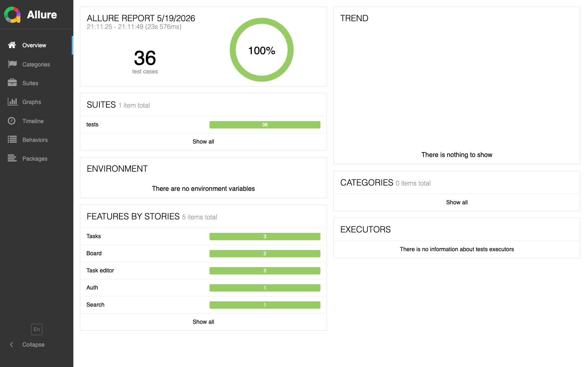
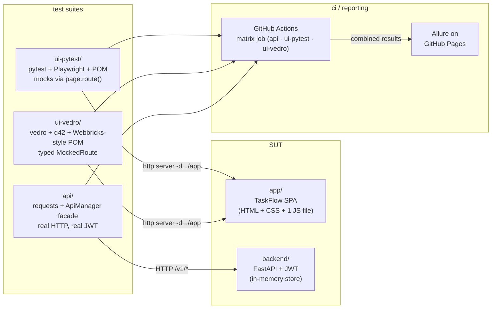
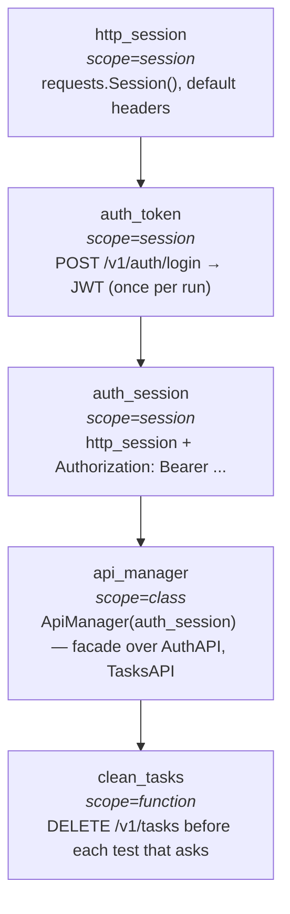

<div align="center">


<br/>

**One application. Two UI test architectures. A REST API suite on top. Same Allure dashboard.**

[](https://github.com/nightmarovvv/qa-automation-portfolio/actions/workflows/ci.yml)
[](#stack)
[](#)
[](#)
[](#)
[](LICENSE)

### → [**Live Allure report**](https://nightmarovvv.github.io/qa-automation-portfolio/) ←


<sub><i>Test driving the SPA: open drawer → fill form → pick status + tags → save → card lands + toast.</i></sub>

<br/>

<a href="https://nightmarovvv.github.io/qa-automation-portfolio/">
  
</a>

</div>

---

> Test architecture is a tradeoff, not a religion. This repo shows the
> same SPA tested two different ways — a classic `pytest` + POM suite
> for the 80%, and a `vedro` + `d42` suite for the deep end — so you can
> see how I think about *when* each stack earns its weight, not just
> *how* I write either one.

---

## 📊 numbers

| | api | ui-pytest | ui-vedro |
|---|---|---|---|
| tests / scenarios | **25** | **11** | **7 (one ×3)** |
| runtime           | ~3s   | ~12s  | ~5s |
| stack             | pytest + requests + ApiManager | pytest + Playwright + POM | vedro + Playwright + d42 |
| isolation         | wipe store per test | mocks via `page.route()` | typed `MockedRoute` w/ strict counts |
| auth              | real JWT against `backend/` | n/a (mocked) | n/a (mocked) |

**43 tests, ~17s in CI, zero flakes.** Everything runs hermetically on the GitHub Actions matrix below.

<sub>The live Allure report shows 36 test cases — 25 api + 11 ui-pytest. The 7 ui-vedro scenarios run in the same CI matrix; the report-merge step for vedro is on the TODO and is the one piece of polish still missing.</sub>

<details>
<summary><b>📈 Graphs view (severity, status, duration)</b></summary>


</details>

---

## 🎯 see a real assertion fail loudly

The SPA wraps `loadTasks` in a 300 ms debounce. The badge in the corner
counts every `GET /api/tasks` the page makes. Five keystrokes in 200 ms
— **the counter goes ×0 → ×1**. Anything else would be a regression in
the debounce, and the test would fail with the exact number it saw.

<div align="center">

</div>

```python
assert len(mock.requests) == 1, (
    f"debounce should coalesce 5 keystrokes into 1 GET, "
    f"got {len(mock.requests)}: {[r.url for r in mock.requests]}"
)
```

This is the test running in CI right now. The assertion message tells
you exactly what went wrong — not "test failed", but "got 3 calls
when 1 was expected, and here are their URLs". That's the difference
between flaky-flavoured tests and load-bearing ones.

---

## 🗺 architecture



---

## 🌱 start where your stack lives

| If your team uses…        | Open                                       |
|---------------------------|--------------------------------------------|
| pytest + Playwright + POM | [**ui-pytest/**](ui-pytest/)               |
| vedro + d42 + Playwright  | [**ui-vedro/**](ui-vedro/)                 |
| REST API testing          | [**api/**](api/)                           |
| FastAPI fixture backend   | [**backend/**](backend/)                   |

The SPA in `app/` is the same in every case. The drawer, the debounce,
the validation, the toast — same product. What changes is the test
side.

---

## ⚖️ same test, two stacks (read this if nothing else)

The single strongest piece of evidence in the repo: the **same**
assertion — "the SPA's 300 ms debounce coalesces 5 keystrokes into one
backend call" — written in both styles.

<table>
<tr>
<th width="50%">ui-pytest <sub>(classic POM, pytest)</sub></th>
<th width="50%">ui-vedro <sub>(BDD steps, typed mock-server)</sub></th>
</tr>
<tr>
<td valign="top">

```python
class TestSearch:

    @pytest.mark.smoke
    def test_debounce_collapses_keystrokes(self, board):
        matching = fake_task(title="Alpha launch retrospective")
        mock = mock_tasks_list(
            board.page, {"data": [matching], "total": 1}
        )

        board.open()
        board.wait_until_ready()
        mock.requests.clear()

        board.search("alpha", delay_ms=30)
        board.page.wait_for_timeout(600)

        assert len(mock.requests) == 1
        assert mock.requests[0].query == {"q": "alpha"}
```

</td>
<td valign="top">

```python
@allure_labels(
    Feature.Search, Story.Search,
    Priority.Critical, AllureID("B-301"),
)
class Scenario(vedro.Scenario):
    subject = "Search input debounces keystrokes..."

    async def given_matching_task(self):
        self.matching_id = fake(ValidIDSchema)
        self.search_response = {
            "data": [fake(TaskSchema % {
                "id": self.matching_id,
                "title": "Alpha launch retrospective",
            })],
            "total": 1,
        }

    async def when_user_types(self):
        async with mocked_tasks_list(
            self.page, self.search_response,
            wait_for_requests=None,
        ) as self.mock:
            await self.board.header.search_input.type(
                "alpha", delay_ms=40
            )
            await self.board.task_list.get_list_task_by_id(
                self.matching_id
            ).wait_for()

    async def then_exactly_one_backend_call(self):
        assert len(self.mock.history) == 1

    async def and_request_carried_the_query(self):
        assert self.mock.history[0].query == {"q": "alpha"}
```

</td>
</tr>
</table>

Same product. Same assertion. Different texture. **That's the point of
the repo.** Both are correct; one fits a 10-test side project, the other
fits a 1000-test suite with five QAs reading each other's code.

---

## 🔌 api/ — fixture chain (the most interesting 50 lines)



`auth_token` is `scope="session"` because POST /login is ~200 ms — 100
tests at function-scope would burn 20 sec doing nothing useful.
`clean_tasks` is per-function because state isolation between tests is
non-negotiable. **Picking the scope is the whole engineering exercise**,
and `api/conftest.py` is annotated for it.

---

## 🧩 architecture choices — when each stack pays off

|                       | ui-pytest (pytest + POM)            | ui-vedro (vedro + d42)                              |
|-----------------------|-------------------------------------|-----------------------------------------------------|
| Best fit              | <300 tests, 1–3 QA                  | 1000+ tests, 5+ QA                                  |
| Onboarding cost       | low                                 | higher, pays back at scale                          |
| Locators              | `data-test` (or CSS/xpath if it fits) | `data-test` only — CSS/xpath forbidden by convention |
| Mocks                 | per-test `page.route()` helpers     | typed `MockedRoute`, `history`, strict count check  |
| API contracts in UI   | dict literals, `fake_*` helpers     | d42 schemas (`fake(Schema % {...})`)                |
| Allure labels         | `@allure.feature/.story` direct     | typed catalog, order enforced by decorator          |
| Iteration speed       | fast                                | slower per test, more guarantees per test           |
| Reading group         | familiar to any pytest user         | familiar to teams on the vedro stack                |

Neither is "better". `ui-pytest` is what I'd reach for on a smaller
team. `ui-vedro` earns its weight once contract-shaped pain starts
showing up in fixtures.

---

## 🧪 what this repo demonstrates (for HR keyword filters too)

- **UI automation** — Playwright (sync + async), Page Object Model, data-test locators, debounce verification, error-recovery flows
- **API automation** — pytest + requests + facade pattern (`ApiManager`), session/class/function fixture scopes, JWT auth, CRUD + filters + validation
- **Mocking** — Playwright `route()` interception (per-test + reusable helpers), typed `RecordedRequest` with strict count assertions
- **Contracts** — d42 schemas with source-cited bounds (HTML attr / regex / API), reused across mocks and assertions
- **Reporting** — Allure, GitHub Pages publishing, typed label catalog, parametrized scenarios with unique TMS ids
- **CI/CD** — GitHub Actions matrix, hermetic test runs, artifact upload, combined Pages deploy on main
- **Backend** — FastAPI service with JWT + Pydantic validation (just enough to back the API suite)

---

## 🚀 running everything locally

```bash
python -m venv .venv && source .venv/bin/activate
pip install -r backend/requirements.txt \
            -r api/requirements.txt \
            -r ui-pytest/requirements.txt
pip install -e ui-vedro
playwright install chromium

# api suite needs the backend up
( cd backend && uvicorn main:app --port 8000 ) &

cd api        && pytest -v
cd ui-pytest  && pytest -v
cd ui-vedro   && make test
```

The SPA in `app/` is plain static files. UI suites boot
`python -m http.server` against it; the FastAPI in `backend/` is only
there for the API suite.

---

## 📂 layout

```
.
├── app/             TaskFlow SPA — fixture under test
├── backend/         minimal FastAPI service (JWT + tasks)
├── ui-pytest/       Track A — pytest + Playwright + classic POM
├── ui-vedro/        Track B — vedro + d42 + Webbricks-style PO
├── api/             pytest + requests + ApiManager facade
└── .github/workflows/ci.yml
```

---

<div align="center">

Built with care. MIT.<br/>
<sub>If you're hiring, I'd love a conversation about <em>when</em> this style of architecture earns its weight versus where it's overkill — that's the most interesting one.</sub>

</div>
